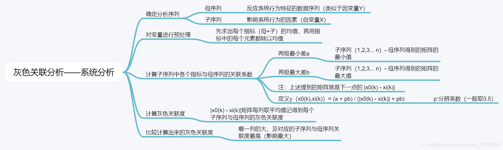
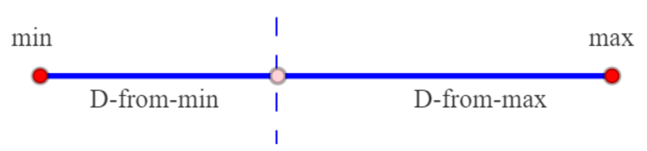
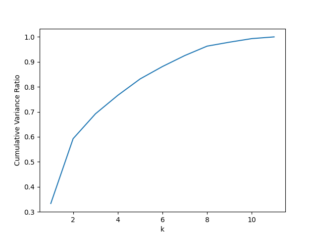
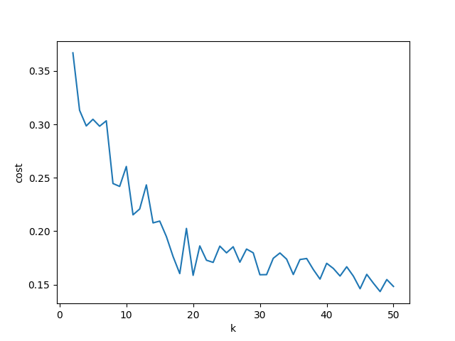

# 球员综合能力评价
使用全部球员数据进行灰色关联度分析（Grey Relation Analysis，GRA），即可得到不同的篮球指标对于综合评价的相关性系数。再利用这一相关性系数对球员数据进行TOPSIS （Technique for Order Preference by Similarity to an Ideal Solution，逼近理想解排序方法），计算各个球员的综合评价分数。输入球员各项数据后即可得到球员的综合评分，从大到小进行球员排名。

## 灰色关联度分析
灰色关联度分析（Grey Relation Analysis）可以在一个灰色系统中，衡量某个项目受其他的因素影响的相对强弱。两个系统之间的因素，随时间或不同对象而变化的关联性大小的量度，称为关联度。两个因素变化即同步变化程度较高，即可谓二者关联程度较高；反之，则较低。因此，灰色关联分析方法，根据因素之间发展趋势的相似相异程度，为衡量因素间关联程度提供了量化的度量。灰色关联分析的基本思想是根据序列曲线几何形状的相似程度来判断其联系是否紧密。曲线越接近，相应序列之间的关联度就越大，反之就越小。


```python
def grey_relation_analysis(data_normalized):
    max_arr = [max(row) for row in data_normalized]
    max_arr_column = [[x] for x in max_arr]
    results = [[abs(x - max_arr_column[i][0]) for x in row] for i, row in enumerate(data_normalized)]

    max_value = max(max(results))
    min_value = min(min(results))
    alpha = [0.9, 0.43, 0.015, 0.075, 0.015, 0.05, 0.2, 0.1, 0.075]
    roi = 0.48
    results = [
        [
            1 / (x + roi * max_value) * (min_value + roi * max_value) * alpha[j]
            for j, x in enumerate(row)
        ]
        for row in results
    ]
    r = [sum(x) for x in zip(*results)]
    r = [x / sum(r) for x in r]
    return r
```
##TOPSIS 
TOPSIS （Technique for Order Preference by Similarity to an Ideal Solution ）模型中文叫做“逼近理想解排序方法”，是根据评价对象与理想化目标的接近程度进行排序的方法，是一种距离综合评价方法。基本思路是通过假定正、负理想解，测算各样本与正、负理想解的距离，得到其与理想方案的相对贴近度（即距离正理想解越近同时距离负理想解越远），进行各评价对象的优劣排序。具体步骤及概念如下：

- step 1： 指标同向化、标准化并得到权重。这部分与熵权法结合，通过熵权法得到权重，避免主观因素影响，得到权重向量W及标准化矩阵P。具体内容可参照综合评价之熵权法，这里不再赘述。

- step 2 ： 得到加权后的规范化矩阵Z。Z由P与W相乘后得到。

- step 3 ： 确定正、负理想解。正理想解指各指标都达到样本中最好的值，负理想解指各指标都为样本中最差的值。

- step 4 ： 计算各样本距离正、负理想解的距离。


    
```python
def topsis(data_normalized, r):
    max_elements = [max(row) for row in zip(*data_normalized)]
    min_elements = [min(row) for row in zip(*data_normalized)]

    max_result = [[(x - max_elements[j]) ** 2 for j, x in enumerate(row)] for row in data_normalized]
    min_result = [[(x - min_elements[j]) ** 2 for j, x in enumerate(row)] for row in data_normalized]

    score1 = [sum(x * r[j] for j, x in enumerate(row)) for row in max_result]
    score2 = [sum(x * r[j] for j, x in enumerate(row)) for row in min_result]

    score = [score2[i] ** 0.5 / (score1[i] ** 0.5 + score2[i] ** 0.5) for 
    return score

```


# 球员对比分析
使用全部球员数据建立KMeans聚类模型，输入球员后使用聚类模型查找其对应聚类并给出类似球员中所属聚类中能力值最高的x名球员（目前返回全部同聚类的球员，后面再改）
## 预处理
- 去除冗余列，保留重要的属性列
```python
column_to_keep = ['player_name', 'player_height', 'player_weight', 'pts', 'reb', 'ast', 'net_rating', 'oreb_pct', 'dreb_pct', 'usg_pct', 'ts_pct', 'ast_pct']
df = df.select(column_to_keep)
```
- 将相同球员不同年份属性平均作为球员属性
```python
df = df.groupBy('player_name').agg(*[avg(column).alias(column) for column in column_to_keep])
```
- 将球员属性转换为一个特征向量并对各列进行归一化
```python
assemble = VectorAssembler(inputCols=column_to_keep, outputCol='features')
df = assemble.transform(df)
scale = StandardScaler(inputCol='features', outputCol='standardized')
scale = scale.fit(df)
df = scale.transform(df)
```
## 模型建立
### 对特征进行PCA降维
```python
def determine_pca(self, df):
    pca = PCA(k=11, inputCol='standardized', outputCol='pca_features')
    pca = pca.fit(df)
    var_ratio = pca.explainedVariance.toArray()
    cum_var_ratio = [sum(var_ratio[:i+1]) for i in range(11)]
    fig, ax = plt.subplots(1,1)
    ax.plot(range(1, 12), cum_var_ratio)
    ax.set_xlabel('k')
    ax.set_ylabel('Cumulative Variance Ratio')
    fig.savefig("./img/pca.png")
    k = min(i + 1 for i in range(11) if cum_var_ratio[i] > 0.9)
    print(f"Chosen k_pca = {k}")
    pca = PCA(k=k, inputCol='standardized', outputCol='pca_features')
    self.pca = pca.fit(df)
```
通过累计可解释方差比例作为衡量指标，将0.9作为阈值进行降维，最终选取降至7维。
累计可解释方差比例可视化

### 选取KMeans的k值
```python
def determine_cluster(self, df):
    df = self.preprocess(df)
    df = self.pca.transform(df)
    scores = []
    evaluator = ClusteringEvaluator(featuresCol='standardized')
    kmin, kmax = 2, 51
    scores = []
    for i in tqdm.tqdm(range(kmin, kmax)):
        model = KMeans(featuresCol='pca_features', k=i).fit(df)
        results = model.transform(df)
        score = evaluator.evaluate(results)
        scores.append(score)
    fig, ax = plt.subplots(1,1)
    ax.plot(range(kmin, kmax), scores)
    ax.set_xlabel('k')
    ax.set_ylabel('cost')
    fig.savefig("./img/kmeans.png")
```
设定不同的k值建立KMeans模型，使用evaluator进行评估，选取局部最优点作为k值，选取k为10

### 建立模型
```python
class Model:
    def __init__(self, path: str) -> None:
        spark = SparkSession.builder.getOrCreate()
        # Load data
        df = spark.read.csv(path, header = True)
        df = self.preprocess(df)
        # PCA
        self.determine_pca(df)
        df = self.pca.transform(df)
        # Train model
        # self.determine_cluster(df)
        self.model = KMeans(featuresCol='pca_features', k=10).fit(df)
        results = self.model.transform(df).select(['player_name', 'prediction'])
        results = results.groupBy('prediction').agg(collect_list('player_name').alias('player_name'))
        self.prediction_dict = results.rdd.collectAsMap()
        with open("./clusters.json", "w") as fp:
            json.dump(self.prediction_dict, fp)
```
读取数据，进行预处理，建立PCA，建立KMeans，对全体数据进行KMeans推理，将结果按照聚类号进行聚合得到映射字典并保存为json文件。
### 推理
```python
def __call__(self, df) -> str:
    df = self.preprocess(df)
    df = self.pca.transform(df)
    df = self.model.transform(df).select(['player_name', 'prediction'])
    results = {}
    for row in df.collect():
        results[row['player_name']] = self.prediction_dict[row["prediction"]]
    return json.dumps(results)
```
预处理-PCA-KMeans，结果逐行通过映射表找到对应聚类的类似球员，结果为列表的列表，写入为一个json字符串
