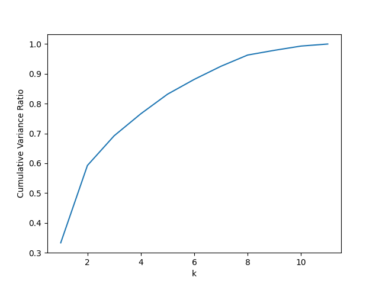
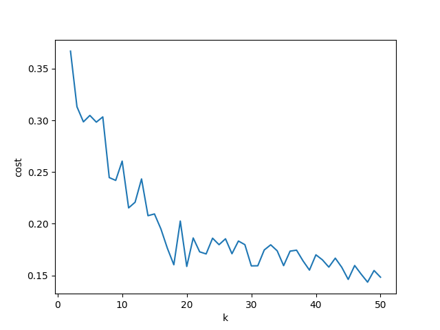

# 球员对比分析
使用全部球员数据建立KMeans聚类模型，输入球员后使用聚类模型查找其对应聚类并给出类似球员中所属聚类中能力值最高的x名球员（目前返回全部同聚类的球员，后面再改）
## 预处理
- 去除冗余列，保留重要的属性列
```python
column_to_keep = ['player_name', 'player_height', 'player_weight', 'pts', 'reb', 'ast', 'net_rating', 'oreb_pct', 'dreb_pct', 'usg_pct', 'ts_pct', 'ast_pct']
df = df.select(column_to_keep)
```
- 将相同球员不同年份属性平均作为球员属性
```python
df = df.groupBy('player_name').agg(*[avg(column).alias(column) for column in column_to_keep])
```
- 将球员属性转换为一个特征向量并对各列进行归一化
```python
assemble = VectorAssembler(inputCols=column_to_keep, outputCol='features')
df = assemble.transform(df)
scale = StandardScaler(inputCol='features', outputCol='standardized')
scale = scale.fit(df)
df = scale.transform(df)
```
## 模型建立
### 对特征进行PCA降维
```python
def determine_pca(self, df):
    pca = PCA(k=11, inputCol='standardized', outputCol='pca_features')
    pca = pca.fit(df)
    var_ratio = pca.explainedVariance.toArray()
    cum_var_ratio = [sum(var_ratio[:i+1]) for i in range(11)]
    fig, ax = plt.subplots(1,1)
    ax.plot(range(1, 12), cum_var_ratio)
    ax.set_xlabel('k')
    ax.set_ylabel('Cumulative Variance Ratio')
    fig.savefig("./img/pca.png")
    k = min(i + 1 for i in range(11) if cum_var_ratio[i] > 0.9)
    print(f"Chosen k_pca = {k}")
    pca = PCA(k=k, inputCol='standardized', outputCol='pca_features')
    self.pca = pca.fit(df)
```
通过累计可解释方差比例作为衡量指标，将0.9作为阈值进行降维，最终选取降至7维。
累计可解释方差比例可视化

### 选取KMeans的k值
```python
def determine_cluster(self, df):
    df = self.preprocess(df)
    df = self.pca.transform(df)
    scores = []
    evaluator = ClusteringEvaluator(featuresCol='standardized')
    kmin, kmax = 2, 51
    scores = []
    for i in tqdm.tqdm(range(kmin, kmax)):
        model = KMeans(featuresCol='pca_features', k=i).fit(df)
        results = model.transform(df)
        score = evaluator.evaluate(results)
        scores.append(score)
    fig, ax = plt.subplots(1,1)
    ax.plot(range(kmin, kmax), scores)
    ax.set_xlabel('k')
    ax.set_ylabel('cost')
    fig.savefig("./img/kmeans.png")
```
设定不同的k值建立KMeans模型，使用evaluator进行评估，选取局部最优点作为k值，选取k为10

### 建立模型
```python
class Model:
    def __init__(self, path: str) -> None:
        spark = SparkSession.builder.getOrCreate()
        # Load data
        df = spark.read.csv(path, header = True)
        df = self.preprocess(df)
        # PCA
        self.determine_pca(df)
        df = self.pca.transform(df)
        # Train model
        # self.determine_cluster(df)
        self.model = KMeans(featuresCol='pca_features', k=10).fit(df)
        results = self.model.transform(df).select(['player_name', 'prediction'])
        results = results.groupBy('prediction').agg(collect_list('player_name').alias('player_name'))
        self.prediction_dict = results.rdd.collectAsMap()
        with open("./clusters.json", "w") as fp:
            json.dump(self.prediction_dict, fp)
```
读取数据，进行预处理，建立PCA，建立KMeans，对全体数据进行KMeans推理，将结果按照聚类号进行聚合得到映射字典并保存为json文件。
### 推理
```python
def __call__(self, df) -> str:
    df = self.preprocess(df)
    df = self.pca.transform(df)
    df = self.model.transform(df).select(['player_name', 'prediction'])
    results = {}
    for row in df.collect():
        results[row['player_name']] = self.prediction_dict[row["prediction"]]
    return json.dumps(results)
```
预处理-PCA-KMeans，结果逐行通过映射表找到对应聚类的类似球员，结果为列表的列表，写入为一个json字符串
